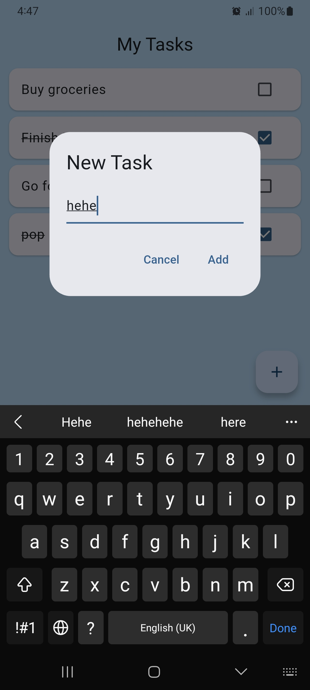
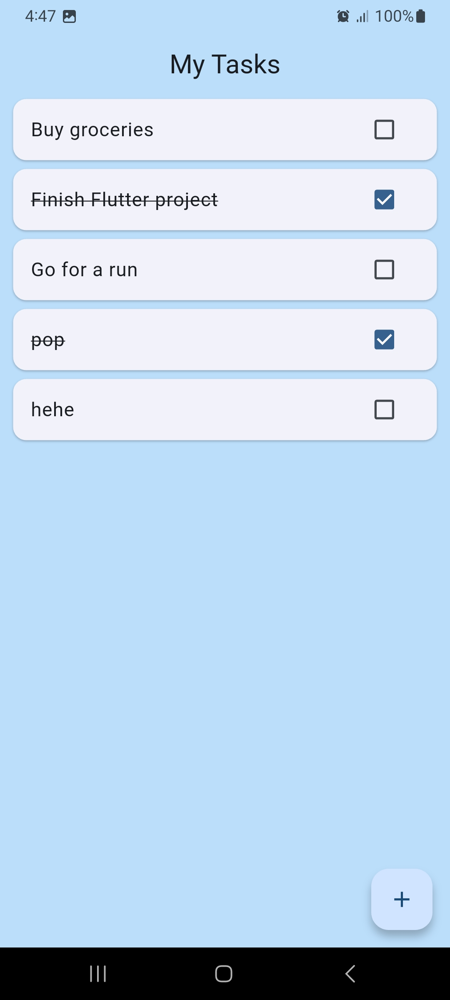

# ✅ My Tasks — Flutter

A Flutter todo app with local persistence using `shared_preferences`.

---

## 📱 Screenshots



)


---

## Features

- View tasks as a scrollable card list
- Check/uncheck tasks with a checkbox (strikethrough on completion)
- Add new tasks via a dialog prompt
- Tasks persist across app restarts using `shared_preferences` + JSON encoding
- Default tasks loaded on first launch

---

## Getting Started

### Prerequisites

- Flutter SDK `>=3.0.0`
- Dart `>=3.0.0`

### Installation

```bash
git clone https://github.com/your-username/flutter-my-tasks.git
cd flutter-my-tasks
flutter pub get
flutter run
```

---

## Dependencies

```yaml
dependencies:
  flutter:
    sdk: flutter
  shared_preferences: ^2.0.0
```

---

## Project Structure

```
lib/
└── main.dart
    ├── MyApp           # Entry point, blue Material 3 theme
    └── TodoListPage    # Task list, add dialog, load/save logic
        ├── _loadTasks()   # Reads tasks JSON from SharedPreferences
        ├── _saveTasks()   # Writes tasks JSON to SharedPreferences
        └── _showAddTaskDialog()  # Dialog for adding a new task
```

---

## Authors

22k-4156 · 22k-4574 · 22k-4431 · 22k-4494

---

## License

MIT License.
